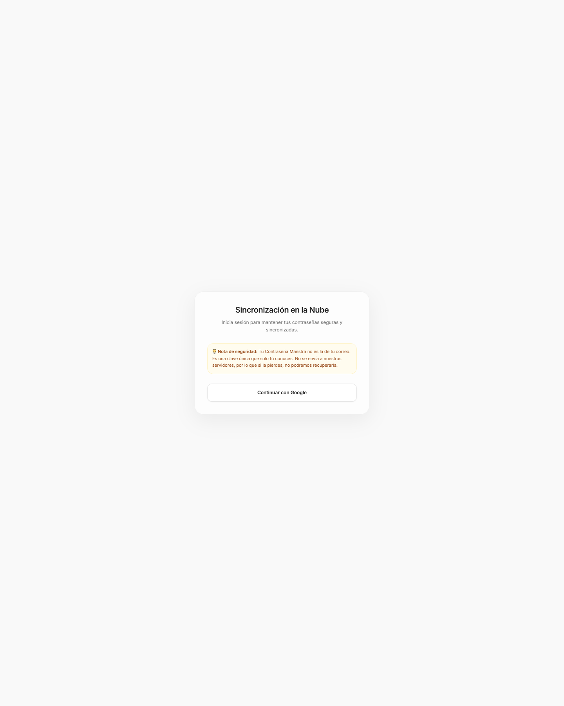

# passwordmanager

Offline-first password vault built with React and Vite.

The app stores encrypted vault data locally and includes optional cloud synchronization. It is designed as a personal password manager experiment, not as a replacement for a professionally audited password manager.

## Screenshot



## What it includes

- local encrypted vault storage
- master-password based unlock flow
- password, account and secure note records
- backup import/export flows
- optional Firebase synchronization

## Tech stack

- React
- TypeScript
- Vite
- IndexedDB
- Firebase

## Local setup

```bash
npm install
npm run dev
```

Firebase sync requires the relevant `VITE_FIREBASE_*` values. The local vault flow can be reviewed without real cloud credentials.

## Social preview

GitHub social preview asset: `public/og-image.png`

## Architecture

The React interface uses a storage layer instead of reading browser APIs directly. Vault records are encrypted before they are written to IndexedDB, and decrypted data remains in the active session only. Import and export use the same encrypted representation.

Firebase is an optional synchronization adapter. Local storage remains the primary path, while the adapter transfers encrypted vault data between devices when Firebase variables are configured.

## Documentation

- DeepWiki: https://deepwiki.com/eneekoruiz/passwordmanager

## Mobile Google Auth (Safari / iOS PWA)

Safari ITP blocks cross-site storage used by Firebase redirect authentication. Production must expose the Firebase Auth helper on the same origin as the app.

For the current Vercel deployment:

1. In Firebase Console, open **Authentication → Settings → Authorized domains** and add passwordmanager-alpha.vercel.app (or the final custom app domain).
2. In Google Cloud Console, open **APIs & Services → Credentials**, edit the OAuth 2.0 Web client used by Firebase, and add https://passwordmanager-alpha.vercel.app/__/auth/handler.
3. In Vercel, set the Production environment variable VITE_FIREBASE_AUTH_DOMAIN=passwordmanager-alpha.vercel.app.
4. Redeploy Production. The vercel.json rewrite proxies /__/auth/* to contras-54017.firebaseapp.com, so the Firebase helper remains first-party.
5. Repeat the authorized-domain and redirect-URI entries for any preview or final custom domain that users will actually open.

Production now promotes `authDomain` to the current HTTPS host when the configured value is `*.firebaseapp.com`. This keeps Firebase Auth same-origin for Safari/iOS PWA and relies on the Vercel `/__/auth/*` rewrite above. Firebase Authorized Domains and Google OAuth redirect URI must still include the production host.
